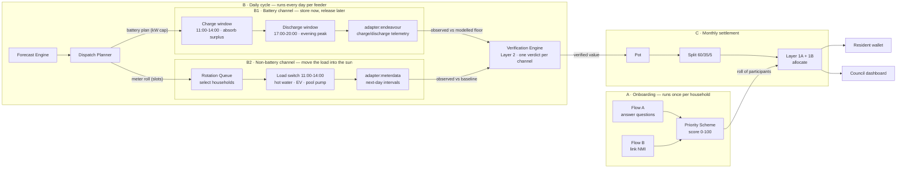
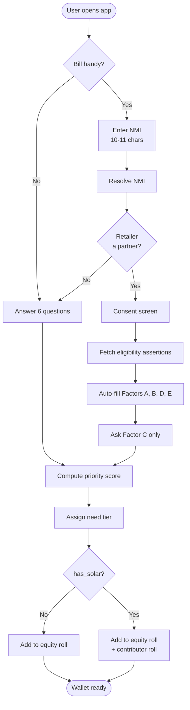
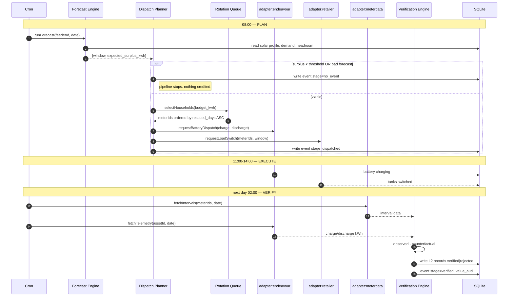
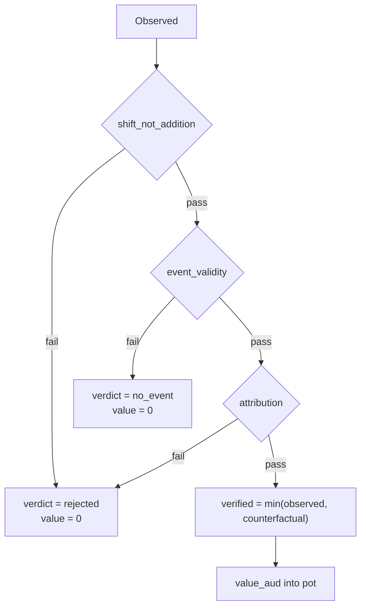
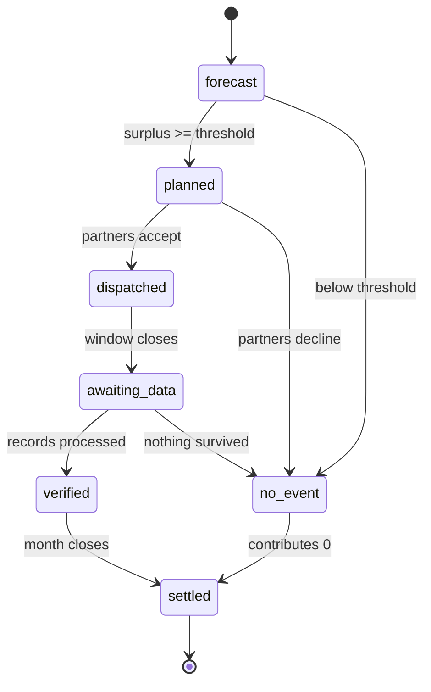
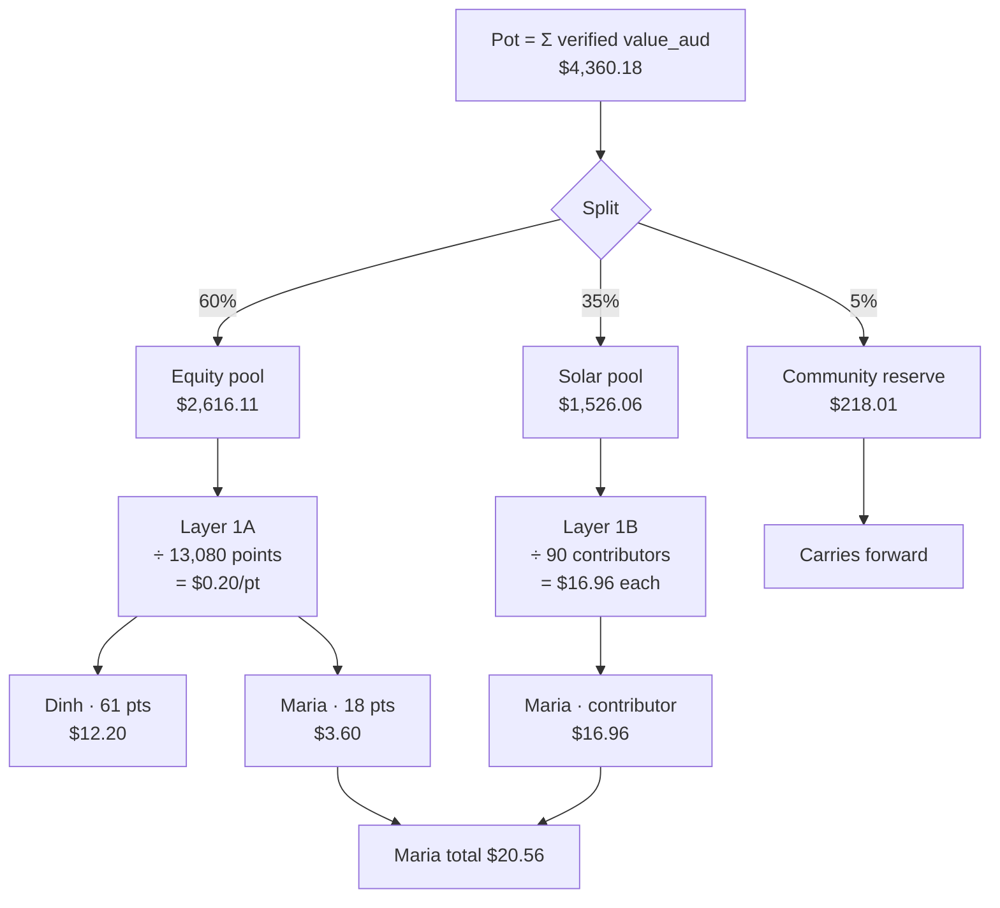
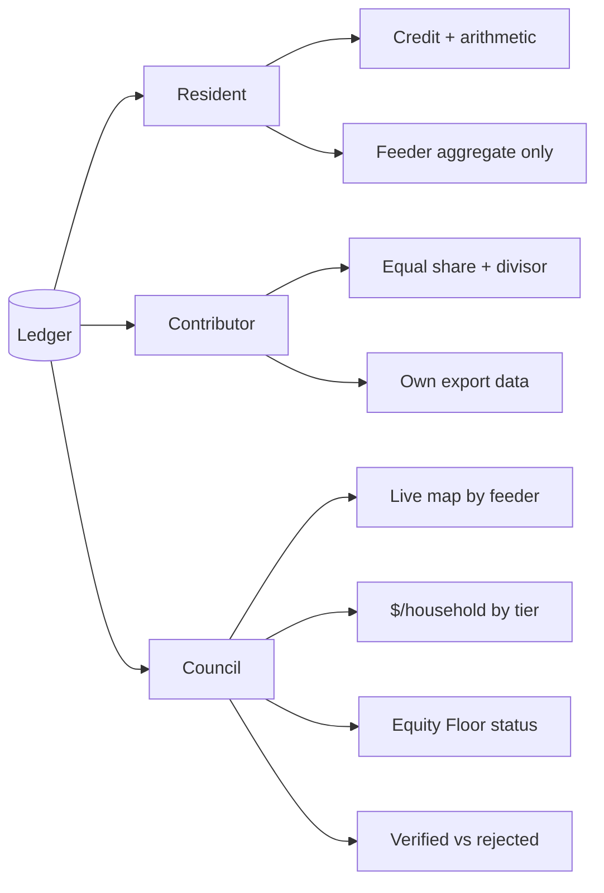

# Sunshine Wallet — Backend Flow Specification

> Implementation companion to `PROTOTYPE_SPEC.md`. This document defines the **runtime flow**: onboarding → forecast → dispatch → verification → settlement → reporting, plus the data contracts and the frontend integration points.
>
> Stack: Node.js (Express, ES modules) · React (Vite) · SQLite (better-sqlite3). Everything external is a **mocked adapter** — the seams are real, the integrations are not.

---

## 1. System overview

Two independent pipelines that meet at the settlement ledger:



The two daily channels run **in parallel off the same forecast** and never queue behind each other — a cloudy morning kills both, a partner outage kills only one. They differ in *when* the energy moves and therefore in how it is proven:

| | B1 · Battery | B2 · Non-battery |
|---|---|---|
| Timing | two windows — charge in surplus, discharge at peak | one window — consumption pulled into the surplus period |
| Asset | community/household battery via `adapter:endeavour` | hot water, EV charger, pool pump via `adapter:retailer` |
| Evidence | charge/discharge telemetry, same day | interval meter data, next day |
| Counterfactual | `documented_limit_component + modelled_lower_bound` | daily total vs baseline (`shift_not_addition`) |
| Fails as | `attribution` — discharge doesn't match the dispatched plan | `shift_not_addition` — load was added, not moved |

Both land in the **same** Verification Engine and the same `verification_records` table, tagged by `channel`. A rejected battery record does not touch the load-shift verdict for the same event, and vice versa — verify per channel, sum after.

**The rule that governs everything:** the daily cycle *fills* the pot; onboarding decides *who divides* it. They never touch until settlement.

---

## 2. Onboarding — two flows, one score



### Scoring model

| Factor | Max | Source in Flow B | Source in Flow A |
|---|---|---|---|
| A · access barrier | 35 | `account_status`, `eapa_last_12m` | asked |
| B · income/concession | 25 | `rebate_band` | asked |
| C · tenure | 15 | **must ask** | asked |
| D · billing arrangement | 10 | `offer_type`, `embedded_network` | asked |
| **Need subtotal** | **85** | | |
| E · contribution capability | 15 | `controlled_load` | asked |
| **Total** | **100** | | |

Tiers by need subtotal: Critical 60-85 · High 40-59 · Moderate 20-39 · Standard 0-19.

**Rules the implementation must enforce:**

1. Money is allocated by **total score**, not tier. Tiers exist for eligibility gates and reporting only — this avoids a cliff-edge where one point changes someone's income.
2. Physical-channel enrolment requires `need_tier >= Moderate` **AND** `contrib_score >= 8`.
3. A failed or unavailable eligibility lookup **never** scores 0 — it falls through to self-declaration with `verification: 'self_declared'`.
4. `rebate_band` is `primary` / `secondary` / `none`. **Never store which program.** Medical and Life Support rebates map to `primary` so no health data enters the system.
5. Life-support status sets `safety_excluded: true` — a scheduling exclusion, never a scoring input.

---

## 3. The daily cycle



### Forecast Engine

```
expected_surplus(t) = Σ potential_generation(t) − Σ baseline_demand(t) − headroom_kw
```

Emits `{ window_start, window_end, expected_surplus_kwh }`. If `expected_surplus_kwh < DISPATCH_THRESHOLD` (default 120 kWh) the event is written as `no_event` and **the pipeline stops**. This state is mandatory — an engine that always finds something to credit is not verifying anything.

### Rotation Queue

Fairness at the scheduling layer:

```
budget_slots = floor(expected_surplus_kwh × TANK_SHARE / KWH_PER_TANK)
eligible     = enrolled AND NOT paused AND NOT safety_excluded
ordered      = eligible.sort(by rescued_days ASC, then id)
selected     = ordered.slice(0, budget_slots)
```

`rescued_days` increments **only on verified actuals**, never on scheduling intent — so a household whose event was cut short automatically moves to the front tomorrow. Sanitation override: any tank whose last full heat exceeds `SANITATION_MAX_DAYS` is force-included regardless of budget, and earns no credit for that cycle.

### Verification Engine — Layer 2



| Check | Fails when |
|---|---|
| `shift_not_addition` | daily total exceeds baseline — consumption was added, not moved |
| `event_validity` | no surplus actually existed during the window |
| `attribution` | response doesn't match dispatch, or resource is committed to another program |

**Battery counterfactual:** claim only the defensible portion. `verified_kwh = documented_limit_component + modelled_component_lower_bound`. Discard the balance — a figure that can't be defended never enters the pot.

**A rejected Layer 2 record must not reduce that household's Layer 1 credit.** Wire them as separate code paths.

---

## 4. Event state machine



Store `stage` on every event row. Both consoles render off it, and the demo animation walks it.

---

## 5. Settlement — monthly



**Two rolls, two divisors — keep them separate:**

| Branch | Roll | Divisor | Formula |
|---|---|---|---|
| **1A** equity | all participants | Σ priority points | `score × (equity_pool / total_points)` |
| **1B** contributor | enrolled solar owners | headcount | `solar_pool / contributor_count` |

Layer 1 checks that must pass before a credit is written:

- **1A:** `token_valid`, `no_duplicate`, `in_program_area`, `score_derivation`, `roll_closure`, `rate_arithmetic`
- **1B:** `system_registered`, `enrolled`, `active_period`, `one_claim_per_point`, `count_closure`, `rate_arithmetic`

**Invariants to assert in code:**

```
Σ all 1A credits          == equity_pool   (±$0.01)
contributor_count × share == solar_pool    (±$0.01)
equity_pct >= 60                            // Equity Floor, reject writes below
```

Pro-rate partial 1B enrolments by `days_enrolled / days_in_period`, then re-normalise so the shares still sum to the pool — this is the case that classically breaks `count_closure`.

---

## 6. Reporting — three audiences



**Privacy rules the API must enforce:**

- Council receives **aggregates only** — never household-level hardship or income. Suppress any cohort under 10 households.
- No endpoint ever returns another household's score, credit, or tier.
- Never imply a household's own contribution produced their own credit. **Contribution and credit are separate facts** — a resident who contributes more does not get paid more, and the UI must not suggest otherwise.

---

## 7. Data model additions

```sql
-- extend households
ALTER TABLE households ADD COLUMN need_score      INTEGER;
ALTER TABLE households ADD COLUMN contrib_score   INTEGER;
ALTER TABLE households ADD COLUMN priority_score  INTEGER;
ALTER TABLE households ADD COLUMN need_tier       TEXT;
ALTER TABLE households ADD COLUMN delivery_mode   TEXT;   -- bill_credit|program_credit|voucher
ALTER TABLE households ADD COLUMN verification    TEXT;   -- retailer_confirmed|self_declared
ALTER TABLE households ADD COLUMN safety_excluded INTEGER DEFAULT 0;
ALTER TABLE households ADD COLUMN paused          INTEGER DEFAULT 0;
ALTER TABLE households ADD COLUMN rescued_days    INTEGER DEFAULT 0;
ALTER TABLE households ADD COLUMN nmi             TEXT;
ALTER TABLE households ADD COLUMN contributor_enrolled_at TEXT;

CREATE TABLE events (
  id TEXT PRIMARY KEY,
  feeder TEXT, date TEXT, stage TEXT,
  forecast_kwh REAL, planned_kwh REAL, dispatched_kwh REAL,
  observed_kwh REAL, verified_kwh REAL, value_aud REAL,
  window_start TEXT, window_end TEXT,
  series_json TEXT
);

CREATE TABLE verification_records (
  id TEXT PRIMARY KEY,
  layer TEXT,            -- '1A' | '1B' | '2'
  event_id TEXT, subject_id TEXT, channel TEXT,
  observed_kwh REAL, counterfactual_kwh REAL, verified_kwh REAL,
  checks_json TEXT, verdict TEXT, value_aud REAL,
  method_version TEXT, created_at TEXT
);

CREATE TABLE settlements (
  id TEXT PRIMARY KEY, period TEXT,
  pot_aud REAL, equity_pool REAL, solar_pool REAL, reserve REAL,
  roll_points INTEGER, rate_aud_pt REAL,
  contributor_count INTEGER, contributor_share REAL
);

CREATE TABLE credits (
  id TEXT PRIMARY KEY, settlement_id TEXT, household_id TEXT,
  branch TEXT,           -- '1A' | '1B'
  amount_aud REAL, delivery_mode TEXT
);
```

Verification records are **append-only**. A correction writes a new record referencing the original — never an edit.

---

## 8. API surface

```
POST /api/onboard/questions      { answers }              -> { score, tier, est_credit }
POST /api/onboard/nmi            { nmi }                  -> { address, retailer, partner: bool }
POST /api/onboard/consent        { nmi, consent }         -> { assertions, prefilled_factors }

POST /api/sim/day                { feeder, date, scenario } -> { event, series, totals }
POST /api/sim/month              {}                       -> { settlement }

GET  /api/events                 ?feeder&from&to          -> [ { id, date, stage, funnel } ]
GET  /api/events/:id                                      -> { funnel, series, records[] }
GET  /api/rotation/:eventId                               -> { queue[], fired[], explanation }

GET  /api/wallet/:householdId                             -> { total, line_items[], story, street }
POST /api/settings/pause         { householdId, paused }  -> { ok }

GET  /api/operator/map                                    -> { feeders[] }
GET  /api/operator/governance                             -> { split, preview_by_tier }
POST /api/operator/governance    { equity, solar, reserve } -> re-settle; 400 if equity < 60
GET  /api/operator/impact        ?period                  -> { aggregates, equity_floor_status }
POST /api/reset                                           -> reseed
```

---

## 9. Adapters — the partner boundary

All external parties sit behind `server/adapters/`. Each exports the shape a real integration would have, backed by the simulation.

```js
// adapters/endeavour.js
requestBatteryDispatch(assetId, plan)  // -> { accepted, capped_kw }
fetchTelemetry(assetId, date)          // -> { charged_kwh, discharged_kwh, intervals[] }

// adapters/retailer.js
requestLoadSwitch(meterIds, window)    // -> { accepted[], rejected[] }
fetchEligibility(nmi)                  // -> assertions (below)
applyCredit(accountRef, amount)        // -> { ok, reference }

// adapters/meterdata.js
fetchIntervals(meterIds, date)         // -> { [meterId]: { controlled_load[], general[] } }
// production: retailer feed (pilot) / CDR (scale). Next-day, not live.

// adapters/eligibility.js
checkRebateStatus(customerRef)         // -> assertions
```

**Eligibility assertion contract:**

```json
{
  "source": "retailer:acme",
  "issued_at": "2026-08-14",
  "rebate_band": "primary",
  "eapa_last_12m": true,
  "account_status": "current",
  "embedded_network": false,
  "offer_type": "standing",
  "controlled_load": true,
  "verification": "retailer_confirmed"
}
```

No CRN. No program names. No documents. Nothing that would embarrass us in a breach.

---

## 10. Frontend integration

| Existing view | Endpoint | New behaviour |
|---|---|---|
| `WalletHardship` | `GET /api/wallet/:id` | line items show arithmetic: `61 pts × $0.20`. Contribution shown as a **separate** fact, never as the cause of the credit |
| `WalletSolar` | `GET /api/wallet/:id` | two lines: 1B contributor share with visible divisor, 1A equity credit |
| `operator/FeederDetail` | `GET /api/events/:id` | **funnel bar** forecast → planned → dispatched → observed → verified, each shorter than the last |
| `operator/Governance` | `GET/POST /api/operator/governance` | reject `equity < 60` with an inline error, not a silent clamp |
| `operator/Rotation` | `GET /api/rotation/:eventId` | queue, fired flags, and a rescued-days histogram that flattens over the month |
| `operator/IndexMap` | `GET /api/operator/map` | stage chip per feeder |
| **new** `Onboarding` | `POST /api/onboard/*` | two-path entry, consent screen, prefilled confirmation |

**Demo choreography for "Run today":**

1. Forecast bar animates in
2. Dispatch fills, tank and battery loads appear on the chart
3. Red curtailment region collapses to a sliver
4. Brief `awaiting data` state — **do not skip this**, it is the honest answer to "is this real-time?"
5. Funnel resolves; the verified bar lands visibly shorter than the forecast bar
6. Wallet totals tick up

---

## 11. Build order

1. **Schema + seed** — 300 households spread across all 12 score/capability combinations, not two archetypes
2. **Priority scheme** — scoring, tiers, both onboarding flows
3. **Forecast + rotation** — including the `no_event` path
4. **Layer 2 verification** — the three checks
5. **Settlement** — split, both Layer 1 branches, invariant assertions
6. **Funnel + event API**
7. **Frontend wiring**

**Seed these edge cases — each is a ten-second demo moment:**

- A **double-heater** (fires midday *and* overnight) → Layer 2 rejection
- A **duplicate enrolment** → Layer 1A failure; removing it *raises* the per-point rate for everyone else
- A **cloudy day** → `no_event`, nothing credited
- An **NMI whose retailer isn't a partner** → falls back to self-declaration
- A **household that self-declares a rebate the token says they don't have** → unclaimed-entitlement nudge

**Automated assertion to surface in the operator console:** the lowest-need / highest-capability household must never out-earn the highest-need / lowest-capability household within the equity pool. Render as `Equity Floor: PASS`, and have the governance UI refuse any split that breaks it.