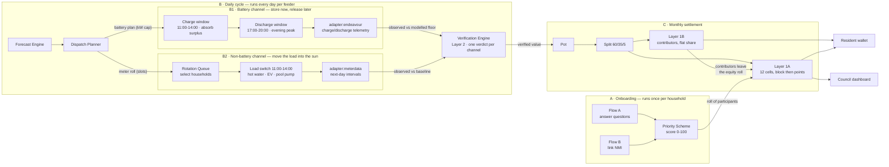
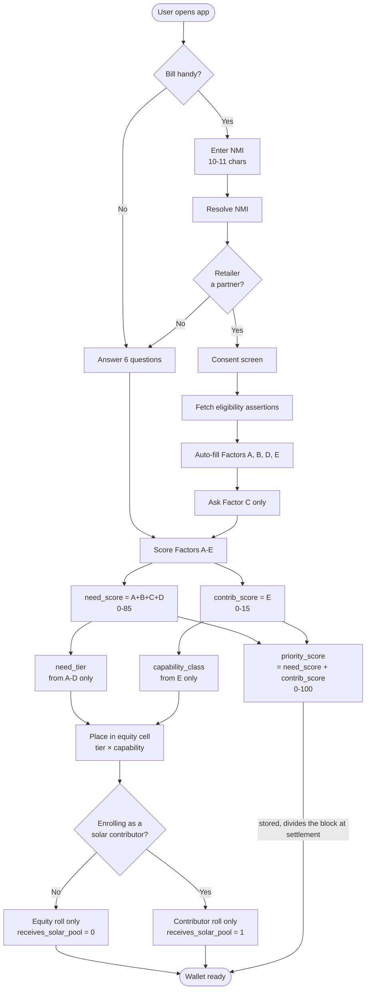
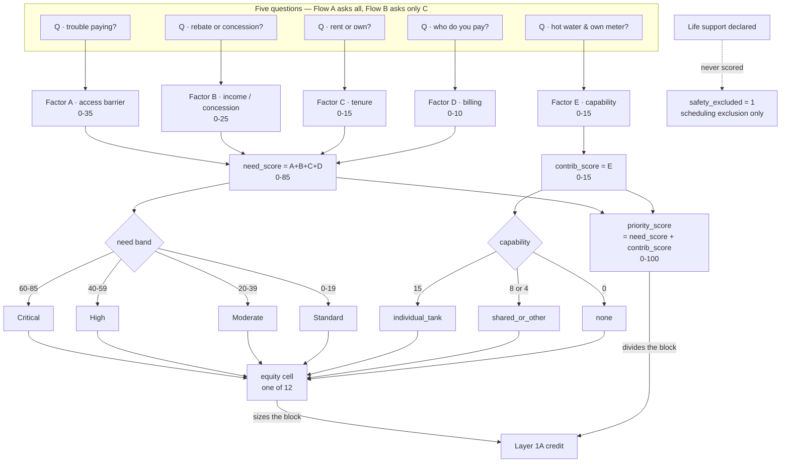
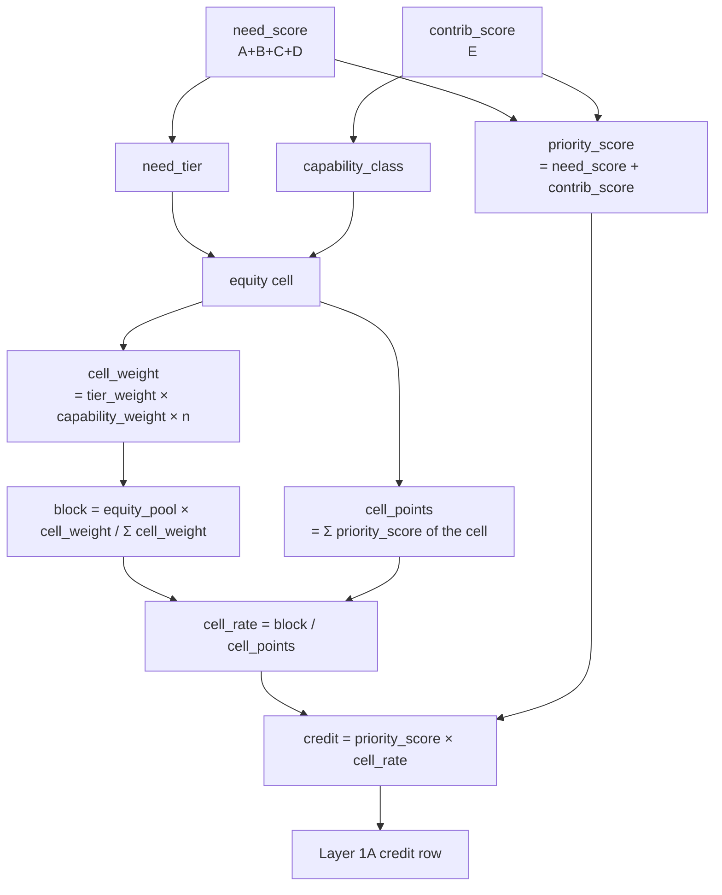
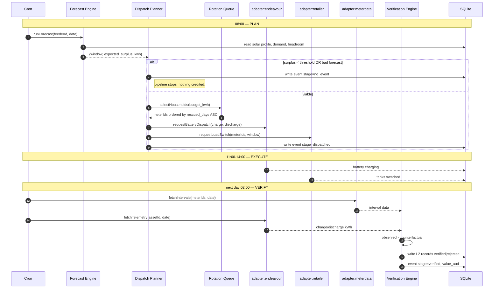
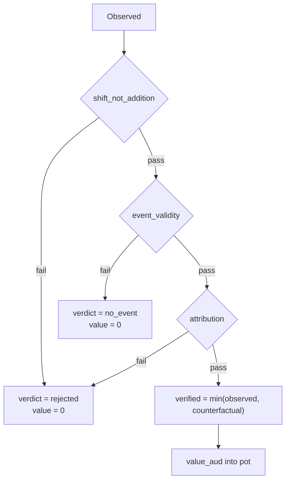
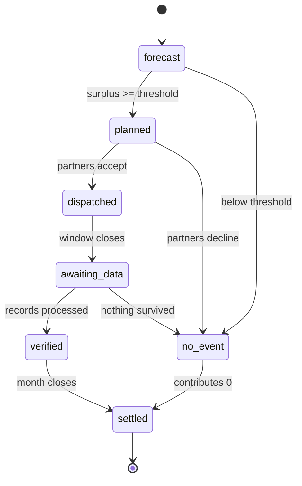
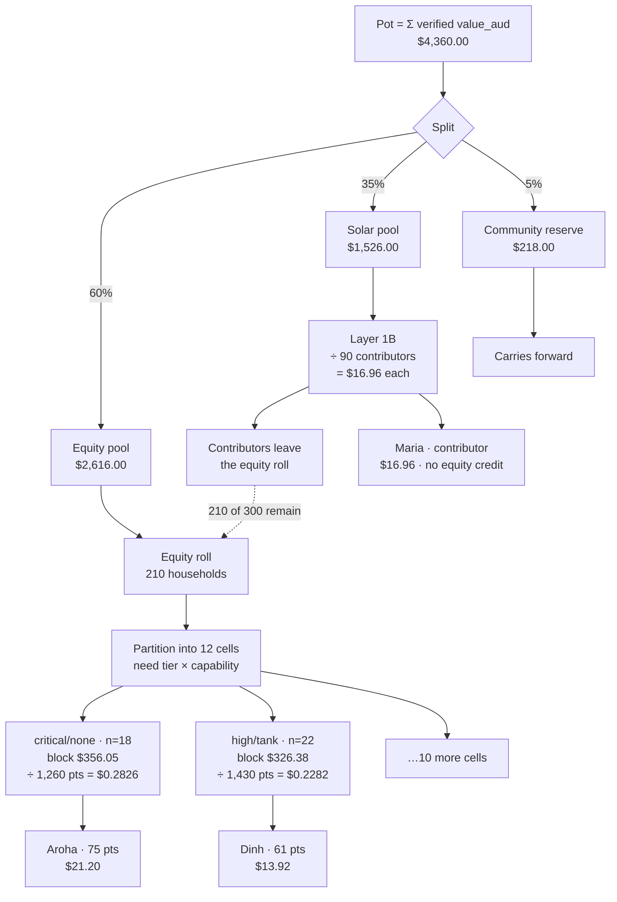
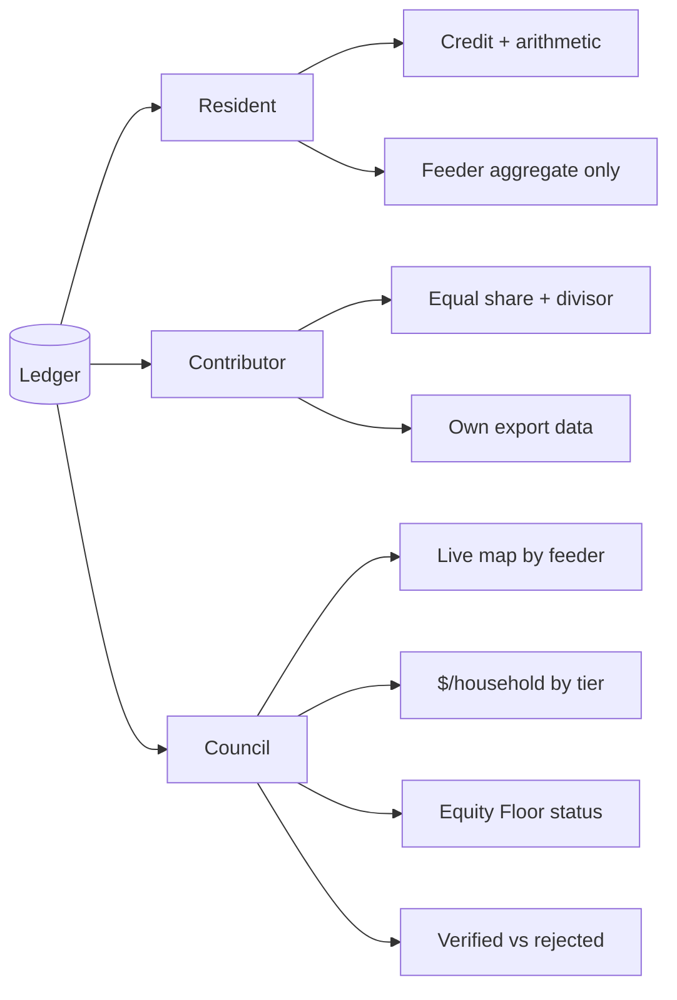

# Sunshine Wallet — Backend Flow Specification

> Implementation companion to `PROTOTYPE_SPEC.md`. This document defines the **runtime flow**: onboarding → forecast → dispatch → verification → settlement → reporting, plus the data contracts and the frontend integration points.
>
> Stack: Node.js (Express, ES modules) · React (Vite) · SQLite (better-sqlite3). Everything external is a **mocked adapter** — the seams are real, the integrations are not.

---

## 1. System overview

Two independent pipelines that meet at the settlement ledger:



The two daily channels run **in parallel off the same forecast** and never queue behind each other — a cloudy morning kills both, a partner outage kills only one. They differ in *when* the energy moves and therefore in how it is proven:

| | B1 · Battery | B2 · Non-battery |
|---|---|---|
| Timing | two windows — charge in surplus, discharge at peak | one window — consumption pulled into the surplus period |
| Asset | community/household battery via `adapter:endeavour` | hot water, EV charger, pool pump via `adapter:retailer` |
| Evidence | charge/discharge telemetry, same day | interval meter data, next day |
| Counterfactual | `documented_limit_component + modelled_lower_bound` | daily total vs baseline (`shift_not_addition`) |
| Fails as | `attribution` — discharge doesn't match the dispatched plan | `shift_not_addition` — load was added, not moved |

Both land in the **same** Verification Engine and the same `verification_records` table, tagged by `channel`. A rejected battery record does not touch the load-shift verdict for the same event, and vice versa — verify per channel, sum after.

**The rule that governs everything:** the daily cycle *fills* the pot; onboarding decides *who divides* it. They never touch until settlement.

---

## 2. Onboarding — two flows, one score



**`priority_score = need_score + contrib_score`** — but notice what the arrows do *not* do: `priority_score` never feeds `need_tier`. The tier branches off `need_score` alone, and the capability class off `contrib_score` alone. The sum is computed in parallel and stored for settlement, where it divides the block its cell was given.

Drawing it the other way — score first, then tier from the score — is the error rule 2 below exists to prevent. It would let fifteen capability points promote a household into a larger block.

The roll question is **enrolment, not ownership**. `has_solar` is recorded but does not route a household — a resident with panels they earn nothing from answers "no" here and lands on the equity roll (§5, §12.1 of the priority scheme).

### Scoring model

Five answers become two scores, and the two scores are used for **different things**. This is the part most easily got wrong, so read the diagram as two tracks that only meet at the credit:



| Factor | Max | Source in Flow B | Source in Flow A |
|---|---|---|---|
| A · access barrier | 35 | `account_status`, `eapa_last_12m` | asked |
| B · income/concession | 25 | `rebate_band` | asked |
| C · tenure | 15 | **must ask** | asked |
| D · billing arrangement | 10 | `offer_type`, `embedded_network` | asked |
| **Need subtotal** | **85** | | |
| E · contribution capability | 15 | `controlled_load` | asked |
| **Total** | **100** | | |

Tiers by need subtotal: Critical 60-85 · High 40-59 · Moderate 20-39 · Standard 0-19.

**Two derived values, and neither replaces the other:**

| Derived | From | Determines |
|---|---|---|
| `need_tier` | Factors A–D only | Which **row** of the equity matrix — and therefore how large a block the household's cell draws |
| `capability_class` | Factor E only | Which **column** — `15 → individual_tank`, `8` or `4 → shared_or_other`, `0 → none` |
| `priority_score` | A+B+C+D+E | The household's **share within its cell**, once the block is set |

The cell decides how much money arrives at the household's group; the score decides how that group's money is split. A household with a high score in a small-block cell can earn less than a household with a lower score in a large-block cell — that is the mechanism working, not a defect.

**Why Factor E cannot move the row:** capability enters `priority_score`, so it moves a household *within* its cell, but `need_tier` is computed from A–D alone. Fifteen capability points can never promote a Standard household into the Critical block. This is the structural form of "need must dominate contribution", and it is why the tier calculation must never be given the total score by mistake.

Factor E's four answer levels fold into three columns — `other controllable load` (4 points) shares `shared_or_other` with the shared tank. The fold changes grouping only; the two still carry different points inside the cell.

### From score to credit

The scoring model does not produce a dollar amount on its own. It produces a **cell** and a **score**, and those two enter the settlement arithmetic at different stages:



Note `priority_score` appears **twice** and in two roles — once summed across the cell as the divisor, once as the household's own numerator. Both uses are the full `need_score + contrib_score`. Only `need_tier` and `capability_class` are restricted to their halves.

```text
cell_weight  = tier_weight × capability_weight × claimant_count
block        = equity_pool × cell_weight / Σ(all cell_weight)
cell_points  = Σ priority_score of claimants in that cell
cell_rate    = block / cell_points
credit       = priority_score × cell_rate
```

**Worked, on the §13 modelled roll** (equity pool $2,616.00, 210 households):

| Household | A+B+C+D | E | need | contrib | **priority** | Cell | Block | Cell points | Cell rate | Credit |
|---|--:|--:|--:|--:|--:|---|--:|--:|--:|--:|
| Aroha — apartment renter, EAPA, instantaneous HW | 75 | 0 | 75 | 0 | **75** | critical / none | $356.05 | 1,260 | $0.2826 | **$21.20** |
| Dinh — private renter, rebate, own tank | 46 | 15 | 46 | 15 | **61** | high / individual_tank | $326.38 | 1,430 | $0.2282 | **$13.92** |
| Cell-representative, best device | 10 | 15 | 10 | 15 | **25** | standard / individual_tank | $69.23 | 350 | $0.1978 | **$4.95** |
| Cell-representative, no device | 10 | 0 | 10 | 0 | **10** | standard / none | $69.23 | 140 | $0.4945 | **$4.95** |

Every row multiplies out: `priority_score × cell_rate = credit`.

Two caveats on the figures. Aroha and Dinh are scored from their §19 profiles and priced at their cell's modelled rate — actually adding them to the roll would shift that cell's points and rate slightly, so treat their credits as indicative. The bottom two rows are their cells' own representative members, so that arithmetic is exact; the final cent there is settled by largest remainder, and two members of one cell can land a cent apart. **The block closes exactly; the individual figure is what absorbs the rounding.**

**Read the last two rows together.** Their priority scores differ by 15 points — 25 against 10 — and they receive **the same credit**. Their cells hold the same headcount and the same tier weight, so they draw the same block; the cell with fewer points converts each point into more money. Under the old flat rate they received $6.51 and $2.60 — a gap of $3.91 that came entirely from the device.

That is the intended behaviour, and it is the clearest statement of what the two scores do: **Factor E moves a household inside its cell, but between two cells of the same tier it moves nothing at all.** Contribution capability is compensated through participation and the Solar Pool, not through a larger share of hardship support.

The corollary matters just as much for anyone reading a wallet screen: **a higher priority score does not guarantee a higher credit.** A household on 30 points in `moderate / none` receives `30 × $0.3297 = $9.89`, while one on 65 points in `high / individual_tank` receives `65 × $0.2282 = $14.83` — the ordering holds there, but it holds because of the tier, not the score. Never present the score to a resident as though it alone determines the payment.

**Rules the implementation must enforce:**

1. Money is allocated by **cell first, then total score**. The cell (tier × capability) sizes the block; the total score divides it. Recompute both from the factor scores at settlement — never trust a stored `need_tier` or `capability_class`, or a re-scored household is paid out of the wrong block.
2. `need_tier` is derived from the **need subtotal (A–D)**, never from `priority_score`. Passing the total into the tier calculation is the single highest-impact bug available in this system: it lets capability points buy a larger block, which inverts the scheme.
3. Physical-channel enrolment requires `need_tier >= Moderate` **AND** `contrib_score >= 8`. Note this gate reads the raw score, not `capability_class` — an `other controllable load` household (E=4) sits in `shared_or_other` for allocation but is below the enrolment gate. The two thresholds are deliberately different and must not be collapsed.
4. A failed or unavailable eligibility lookup **never** scores 0 — it falls through to self-declaration with `verification: 'self_declared'`. A zero score is not a neutral default here: it drops the household off the equity roll entirely (§5), so a lookup failure must never be allowed to look like an answer.
5. `rebate_band` is `primary` / `secondary` / `none`. **Never store which program.** Medical and Life Support rebates map to `primary` so no health data enters the system.
6. Life-support status sets `safety_excluded: true` — a scheduling exclusion, never a scoring input.
7. Equity-roll membership is decided by `receives_solar_pool`, not `has_solar`. Both fields are stored; only the first routes money.

---

## 3. The daily cycle



### Forecast Engine

```
expected_surplus(t) = Σ potential_generation(t) − Σ baseline_demand(t) − headroom_kw
```

Emits `{ window_start, window_end, expected_surplus_kwh }`. If `expected_surplus_kwh < DISPATCH_THRESHOLD` (default 120 kWh) the event is written as `no_event` and **the pipeline stops**. This state is mandatory — an engine that always finds something to credit is not verifying anything.

### Rotation Queue

Fairness at the scheduling layer:

```
budget_slots = floor(expected_surplus_kwh × TANK_SHARE / KWH_PER_TANK)
eligible     = enrolled AND NOT paused AND NOT safety_excluded
ordered      = eligible.sort(by rescued_days ASC, then id)
selected     = ordered.slice(0, budget_slots)
```

`rescued_days` increments **only on verified actuals**, never on scheduling intent — so a household whose event was cut short automatically moves to the front tomorrow. Sanitation override: any tank whose last full heat exceeds `SANITATION_MAX_DAYS` is force-included regardless of budget, and earns no credit for that cycle.

### Verification Engine — Layer 2



| Check | Fails when |
|---|---|
| `shift_not_addition` | daily total exceeds baseline — consumption was added, not moved |
| `event_validity` | no surplus actually existed during the window |
| `attribution` | response doesn't match dispatch, or resource is committed to another program |

**Battery counterfactual:** claim only the defensible portion. `verified_kwh = documented_limit_component + modelled_component_lower_bound`. Discard the balance — a figure that can't be defended never enters the pot.

**A rejected Layer 2 record must not reduce that household's Layer 1 credit.** Wire them as separate code paths.

---

## 4. Event state machine



Store `stage` on every event row. Both consoles render off it, and the demo animation walks it.

---

## 5. Settlement — monthly



**Settle 1B before 1A.** The contributor roll determines who is on the equity roll; computing both from the same household list in parallel is how a household gets paid twice.

**Two rolls, and they no longer overlap:**

| Branch | Roll | Divisor | Formula |
|---|---|---|---|
| **1B** contributor | enrolled solar contributors | headcount | `solar_pool / contributor_count` |
| **1A** equity | participants **not** paid from 1B, with score > 0 | Σ points *within each cell* | `score × (cell_block / cell_points)` |

Layer 1A is now a two-stage division. The pool splits into twelve cell blocks by `tier_weight × claimant_count`, and only inside a cell do priority points divide the block:

```
cell_block = equity_pool × (tier_weight × n) / Σ(tier_weight × n)
cell_rate  = cell_block / cell_points
credit     = score × cell_rate
```

Default `tier_weight` is `critical 4 · high 3 · moderate 2 · standard 1`; `capability_weight` defaults to 1 across all three classes. Both are governance policy — see the priority scheme §12.3 and §22.

**There is no single per-point rate any more.** Twelve cells means twelve rates, and they move in the opposite direction to capability: `$0.4945/pt` in standard/none against `$0.1978/pt` in standard/tank. Any endpoint or UI that returns one headline `rate_aud_pt` is misreporting what a household is owed.

Layer 1 checks that must pass before a credit is written:

- **1A:** `token_valid`, `no_duplicate`, `in_program_area`, `score_derivation`, `cell_derivation`, `pool_exclusivity`, `roll_closure`, `block_closure`, `rate_arithmetic`
- **1B:** `system_registered`, `enrolled`, `active_period`, `one_claim_per_point`, `pool_exclusivity`, `count_closure`, `rate_arithmetic`

Two checks are new:

| Check | Fails when |
|---|---|
| `pool_exclusivity` | the household appears on both the 1A and 1B roll for the same period |
| `cell_derivation` | stored `need_tier` / `capability_class` disagree with the factor scores they are recomputed from |
| `block_closure` | the twelve cell blocks do not sum to the equity pool |

**Invariants to assert in code:**

```
Σ 12 cell blocks          == equity_pool   (exact, integer cents)
Σ all 1A credits          == equity_pool   (exact, integer cents)
contributor_count × share == solar_pool    (±$0.01)
1A_roll ∩ 1B_roll         == ∅             // pool exclusivity
equity_pct >= 60                           // Equity Floor, reject writes below
avg_credit(critical) >= avg_credit(high) >= avg_credit(moderate) >= avg_credit(standard)
```

Use integer cents and largest-remainder rounding at **both** levels — pool → blocks, block → households. A ±$0.01 tolerance is not needed for 1A once the arithmetic is integral, and accepting one hides a genuine closure bug.

Pro-rate partial 1B enrolments by `days_enrolled / days_in_period`, then re-normalise so the shares still sum to the pool — this is the case that classically breaks `count_closure`. A household that enrols mid-period is settled from 1B for the whole period and stays off the 1A roll; do not split one household across both pools within a period.

**Carry cases:** if no contributors are enrolled, the solar pool carries to the reserve. If no household is equity-eligible, the whole equity pool carries. Write the carry as an explicit ledger row — an undistributed pool that simply disappears will not reconcile.

---

## 6. Reporting — three audiences



**Privacy rules the API must enforce:**

- Council receives **aggregates only** — never household-level hardship or income. Suppress any cohort under 10 households.
- No endpoint ever returns another household's score, credit, or tier.
- Never imply a household's own contribution produced their own credit. **Contribution and credit are separate facts** — a resident who contributes more does not get paid more, and the UI must not suggest otherwise.

---

## 7. Data model additions

```sql
-- extend households
ALTER TABLE households ADD COLUMN need_score      INTEGER;  -- A+B+C+D, 0-85
ALTER TABLE households ADD COLUMN contrib_score   INTEGER;  -- E, 0-15
ALTER TABLE households ADD COLUMN priority_score  INTEGER;  -- need_score + contrib_score, 0-100
ALTER TABLE households ADD COLUMN need_tier       TEXT;   -- critical|high|moderate|standard
ALTER TABLE households ADD COLUMN capability_class TEXT;  -- individual_tank|shared_or_other|none
ALTER TABLE households ADD COLUMN has_solar       INTEGER DEFAULT 0;  -- owns panels
ALTER TABLE households ADD COLUMN receives_solar_pool INTEGER DEFAULT 0; -- paid as contributor
ALTER TABLE households ADD COLUMN delivery_mode   TEXT;   -- bill_credit|program_credit|voucher
ALTER TABLE households ADD COLUMN verification    TEXT;   -- retailer_confirmed|self_declared
ALTER TABLE households ADD COLUMN safety_excluded INTEGER DEFAULT 0;
ALTER TABLE households ADD COLUMN paused          INTEGER DEFAULT 0;
ALTER TABLE households ADD COLUMN rescued_days    INTEGER DEFAULT 0;
ALTER TABLE households ADD COLUMN nmi             TEXT;
ALTER TABLE households ADD COLUMN contributor_enrolled_at TEXT;

CREATE TABLE events (
  id TEXT PRIMARY KEY,
  feeder TEXT, date TEXT, stage TEXT,
  forecast_kwh REAL, planned_kwh REAL, dispatched_kwh REAL,
  observed_kwh REAL, verified_kwh REAL, value_aud REAL,
  window_start TEXT, window_end TEXT,
  series_json TEXT
);

CREATE TABLE verification_records (
  id TEXT PRIMARY KEY,
  layer TEXT,            -- '1A' | '1B' | '2'
  event_id TEXT, subject_id TEXT, channel TEXT,
  observed_kwh REAL, counterfactual_kwh REAL, verified_kwh REAL,
  checks_json TEXT, verdict TEXT, value_aud REAL,
  method_version TEXT, created_at TEXT
);

CREATE TABLE settlements (
  id TEXT PRIMARY KEY, period TEXT,
  pot_cents INTEGER, equity_pool_cents INTEGER,
  solar_pool_cents INTEGER, reserve_cents INTEGER,
  equity_roll_count INTEGER,        -- participants minus contributors
  contributor_count INTEGER, contributor_share_cents INTEGER,
  carried_cents INTEGER DEFAULT 0,  -- undistributable pool -> reserve
  policy_version TEXT               -- split + weights in force
);

-- One row per equity cell per settlement. There is no single
-- rate_aud_pt any more; the rate lives here, twelve times.
CREATE TABLE settlement_cells (
  id TEXT PRIMARY KEY, settlement_id TEXT,
  need_tier TEXT, capability_class TEXT,
  claimant_count INTEGER,           -- members with score > 0
  cell_points INTEGER,
  cell_weight REAL,                 -- tier_weight × capability_weight × n
  block_cents INTEGER,
  rate_cents_per_point REAL
);

CREATE TABLE credits (
  id TEXT PRIMARY KEY, settlement_id TEXT, household_id TEXT,
  branch TEXT,           -- '1A' | '1B'
  settlement_cell_id TEXT,  -- 1A only; the block this credit came out of
  priority_score INTEGER,   -- 1A only; frozen at settlement
  amount_cents INTEGER, delivery_mode TEXT
);
```

Amounts move to **integer cents**. Cell blocks and per-household shares are distributed by largest remainder, so `Σ block_cents = equity_pool_cents` and `Σ amount_cents = equity_pool_cents` hold exactly — a REAL column reintroduces the drift the invariants exist to catch.

`settlement_cells` is what makes a credit explainable: a resident's row joins to their cell, and the three numbers behind their amount — block, divisor, own score — are all on it. Store `priority_score` on the credit as well, frozen at settlement, so a later re-score never silently rewrites a past statement.

A partial `UNIQUE (settlement_id, household_id)` index enforces `pool_exclusivity` at the database rather than in application code.

Verification records are **append-only**. A correction writes a new record referencing the original — never an edit.

---

## 8. API surface

```
POST /api/onboard/questions      { answers }              -> { score, tier, est_credit }
POST /api/onboard/nmi            { nmi }                  -> { address, retailer, partner: bool }
POST /api/onboard/consent        { nmi, consent }         -> { assertions, prefilled_factors }

POST /api/sim/day                { feeder, date, scenario } -> { event, series, totals }
POST /api/sim/month              {}                       -> { settlement }

GET  /api/events                 ?feeder&from&to          -> [ { id, date, stage, funnel } ]
GET  /api/events/:id                                      -> { funnel, series, records[] }
GET  /api/rotation/:eventId                               -> { queue[], fired[], explanation }

GET  /api/wallet/:householdId                             -> { total, line_items[], story, street }
POST /api/settings/pause         { householdId, paused }  -> { ok }

GET  /api/operator/map                                    -> { feeders[] }
GET  /api/operator/governance                             -> { split, tier_weights, capability_weights, preview_by_cell }
POST /api/operator/governance    { equity, solar, reserve,
                                   tier_weights, capability_weights }
                                 -> re-settle; 400 if equity < 60,
                                    any weight <= 0, tier weights not
                                    strictly decreasing, or the re-run
                                    breaks an Equity Floor assertion
GET  /api/settlement/:id/cells                            -> { cells[12] }
GET  /api/operator/impact        ?period                  -> { aggregates, equity_floor_status }
POST /api/reset                                           -> reseed
```

---

## 9. Adapters — the partner boundary

All external parties sit behind `server/adapters/`. Each exports the shape a real integration would have, backed by the simulation.

```js
// adapters/endeavour.js
requestBatteryDispatch(assetId, plan)  // -> { accepted, capped_kw }
fetchTelemetry(assetId, date)          // -> { charged_kwh, discharged_kwh, intervals[] }

// adapters/retailer.js
requestLoadSwitch(meterIds, window)    // -> { accepted[], rejected[] }
fetchEligibility(nmi)                  // -> assertions (below)
applyCredit(accountRef, amount)        // -> { ok, reference }

// adapters/meterdata.js
fetchIntervals(meterIds, date)         // -> { [meterId]: { controlled_load[], general[] } }
// production: retailer feed (pilot) / CDR (scale). Next-day, not live.

// adapters/eligibility.js
checkRebateStatus(customerRef)         // -> assertions
```

**Eligibility assertion contract:**

```json
{
  "source": "retailer:acme",
  "issued_at": "2026-08-14",
  "rebate_band": "primary",
  "eapa_last_12m": true,
  "account_status": "current",
  "embedded_network": false,
  "offer_type": "standing",
  "controlled_load": true,
  "verification": "retailer_confirmed"
}
```

No CRN. No program names. No documents. Nothing that would embarrass us in a breach.

---

## 10. Frontend integration

| Existing view | Endpoint | New behaviour |
|---|---|---|
| `WalletHardship` | `GET /api/wallet/:id` | line items show the two-stage arithmetic: `high/tank block $326.38 ÷ 1,430 pts = $0.2282` then `61 pts × $0.2282 = $13.92`. Contribution shown as a **separate** fact, never as the cause of the credit |
| `WalletSolar` | `GET /api/wallet/:id` | **one** line, not two: the 1B contributor share with its visible divisor. Contributors draw no equity credit — state that plainly rather than rendering a `$0.00` equity row that reads as a denial |
| `operator/FeederDetail` | `GET /api/events/:id` | **funnel bar** forecast → planned → dispatched → observed → verified, each shorter than the last |
| `operator/Governance` | `GET/POST /api/operator/governance` | reject `equity < 60` with an inline error, not a silent clamp. Weight editors re-run the settlement against the live roll and show which two cells inverted on failure |
| **new** `operator/EquityCells` | `GET /api/settlement/:id/cells` | the 12-cell table — n, points, weight, block, block %, cell rate, credit each. Show per-tier averages as the headline; never one global `$/pt` |
| `operator/Rotation` | `GET /api/rotation/:eventId` | queue, fired flags, and a rescued-days histogram that flattens over the month |
| `operator/IndexMap` | `GET /api/operator/map` | stage chip per feeder |
| **new** `Onboarding` | `POST /api/onboard/*` | two-path entry, consent screen, prefilled confirmation |

**Demo choreography for "Run today":**

1. Forecast bar animates in
2. Dispatch fills, tank and battery loads appear on the chart
3. Red curtailment region collapses to a sliver
4. Brief `awaiting data` state — **do not skip this**, it is the honest answer to "is this real-time?"
5. Funnel resolves; the verified bar lands visibly shorter than the forecast bar
6. Wallet totals tick up

---

## 11. Build order

1. **Schema + seed** — 300 households with every one of the 12 cells populated, not two archetypes; include one `has_solar` household that is *not* a contributor
2. **Priority scheme** — scoring, tiers, capability classes, both onboarding flows
3. **Forecast + rotation** — including the `no_event` path
4. **Layer 2 verification** — the three checks
5. **Settlement** — split, 1B first, then the 12-cell 1A allocation, invariant assertions
6. **Funnel + event API**
7. **Frontend wiring**

**Seed these edge cases — each is a ten-second demo moment:**

- A **double-heater** (fires midday *and* overnight) → Layer 2 rejection
- A **duplicate enrolment** → Layer 1A failure; removing it *raises* the rate in that household's cell for everyone else in it
- A **contributor who also scores high on need** → appears on the 1B roll only; `pool_exclusivity` rejects any 1A credit written for them
- A **social-housing tenant with landlord-owned panels** → `has_solar = 1`, `receives_solar_pool = 0`; stays on the equity roll. This is the case an ownership-based eligibility check gets wrong
- A **cloudy day** → `no_event`, nothing credited
- An **NMI whose retailer isn't a partner** → falls back to self-declaration
- A **household that self-declares a rebate the token says they don't have** → unclaimed-entitlement nudge

**Automated assertion to surface in the operator console:** the lowest-need / highest-capability household must never out-earn the highest-need / lowest-capability household within the equity pool. Render as `Equity Floor: PASS`, and have the governance UI refuse any split that breaks it.