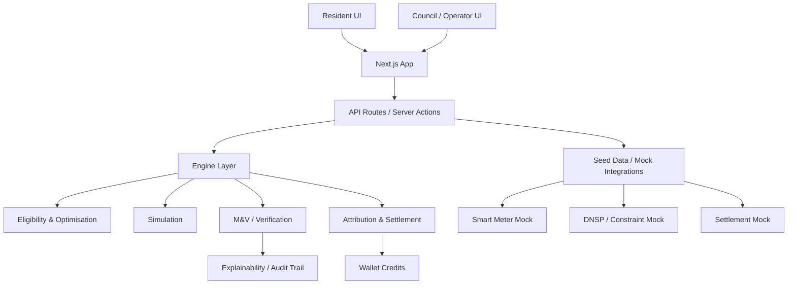

# Sunshine Wallet Architecture

Version: 1.0
Date: 2026-08-22
Scope: Hackathon MVP architecture for Sunshine Wallet

## 1. Architecture goal

The project must support one complete, defensible flexibility event from need identification to verified settlement, while staying within the constraints of a 25-hour build window and a three-person team.

The architecture is deliberately simple, explainable, and low-risk:

- one Next.js web app
- resident and council/operator experiences in the same codebase
- route handlers and server actions for backend logic
- shared TypeScript domain model across the app
- mocked external systems instead of production integrations
- deterministic engine logic rather than opaque AI

This is the correct architecture for this project because the project brief explicitly says:

- "One Next.js web app; resident mobile-style view + Council desktop view."
- "Backend: Next.js route handlers/server actions; no microservices."
- "External systems are mocked/simulated."
- "Real code: window selection, eligibility, optimiser, simulation, M&V, contributor attribution, Equity Floor and settlement."

The design therefore is not a production event-driven service mesh. It is a single application with clean internal layering.

---

## 2. Architecture principles

### 2.1 Keep one coherent app
The MVP should be built as one deployable application, not separate repositories or separate runtime services.

### 2.2 Separate concerns internally
Even though it is one app, we still separate responsibilities into layers:

- presentation layer
- API layer
- domain logic / engine layer
- data layer
- mock integrations

### 2.3 Explainability over cleverness
Judges and reviewers should be able to understand why a particular event was selected, how a resource was scored, what changed versus baseline, and why a credit was allocated.

### 2.4 Deterministic engine
The optimiser, M&V logic, and settlement must be predictable and testable. This is essential to the credibility of the demo.

### 2.5 Mock external systems by design
Smart metering, market settlement, and distributor topology are not production integrations in the MVP. They are mocked modules with realistic interfaces and data shapes.

---

## 3. High-level system view



---

## 4. Architectural boundaries

### 4.1 Presentation layer
This layer handles:

- resident wallet screens
- council/operator dashboard screens
- event cards and summary pages
- forms for participant consent and approval
- charts and tables explaining impact and settlement

This is the user-facing layer and should remain thin. It should mainly render data and call API functions.

### 4.2 API layer
This layer handles:

- route handlers for REST-like endpoints
- server actions for form submissions
- validation of incoming payloads
- orchestration calls to engine functions
- JSON responses to the frontend

This is the boundary between the UI and the business logic.

### 4.3 Domain / engine layer
This is the core of the application. It contains the deterministic logic for:

- event-window selection
- eligibility checks
- resource scoring
- optimisation
- dispatch simulation
- baseline vs observed comparison
- M&V confidence evaluation
- contributor attribution
- settlement and equity credits

This layer is the most important for the demo and must be explicit and testable.

### 4.4 Data layer
This layer provides the project’s source of truth for the MVP.

For the hackathon, this is seeded TypeScript/JSON data, not a full production database architecture.

It contains:

- participants
- Sunshine Cells
- resources
- events
- verification records
- settlements
- wallet transactions

### 4.5 Mock integration layer
This layer simulates the systems the demo depends on without building real external integrations.

It includes mock modules for:

- smart meter readings
- DNSP or local network constraint data
- device dispatch acknowledgements
- retailer settlement acknowledgements

---

## 5. Why this is the correct architecture for this project

### 5.1 A single app matches the contract
The API contract explicitly says the app will be a single Next.js web application. The backend is not microservices; it is route handlers and server actions in the same app.

### 5.2 The MVP needs speed
The project is constrained to 25 hours and a small team. A single app minimizes coordination cost and reduces integration risk.

### 5.3 The demo is journey-focused, not platform-focused
The main deliverable is a single complete event loop. The project should not be architected as a broad platform with separate services that would distract from the judge-visible demo.

### 5.4 Deterministic logic matters more than service separation
The project is judged on transparency and explainability. A single app with a clean engine layer is the best way to show the logic without hiding it behind a complex distributed system.

---

## 6. Recommended folder structure

```text
sunshine-wallet/
├── app/
│   ├── api/
│   │   ├── health/route.ts
│   │   ├── bootstrap/route.ts
│   │   ├── residents/
│   │   │   ├── route.ts
│   │   │   └── [residentId]/
│   │   │       ├── route.ts
│   │   │       ├── wallet/route.ts
│   │   │       └── events/route.ts
│   │   ├── resources/
│   │   │   ├── route.ts
│   │   │   └── [resourceId]/route.ts
│   │   ├── cells/
│   │   │   ├── route.ts
│   │   │   └── [cellId]/route.ts
│   │   ├── events/
│   │   │   ├── route.ts
│   │   │   └── [eventId]/
│   │   │       ├── route.ts
│   │   │       ├── optimise/route.ts
│   │   │       ├── simulate/route.ts
│   │   │       ├── verify/route.ts
│   │   │       └── settle/route.ts
│   │   ├── attribution/
│   │   │   └── [eventId]/route.ts
│   │   └── mock/
│   │       ├── meters/
│   │       ├── dnsp/
│   │       └── settlement/
│   ├── resident/
│   │   ├── page.tsx
│   │   ├── wallet/page.tsx
│   │   └── events/page.tsx
│   ├── council/
│   │   ├── page.tsx
│   │   ├── events/page.tsx
│   │   └── settlement/page.tsx
│   ├── globals.css
│   ├── layout.tsx
│   └── page.tsx
│
├── components/
│   ├── resident/
│   ├── council/
│   ├── charts/
│   ├── ui/
│   └── shared/
│
├── lib/
│   ├── api/
│   │   ├── residents.ts
│   │   ├── events.ts
│   │   ├── resources.ts
│   │   └── settlement.ts
│   ├── engine/
│   │   ├── event-window.ts
│   │   ├── eligibility.ts
│   │   ├── optimiser.ts
│   │   ├── simulation.ts
│   │   ├── verification.ts
│   │   ├── attribution.ts
│   │   └── settlement.ts
│   ├── data/
│   │   ├── seed.ts
│   │   ├── fixtures.ts
│   │   └── mock-data.ts
│   ├── types/
│   │   ├── models.ts
│   │   └── api.ts
│   ├── formatters.ts
│   └── utils.ts
│
├── services/
│   ├── mock-meter.ts
│   ├── mock-dnsp.ts
│   └── mock-settlement.ts
│
├── docs/
│   └── project PDFs
├── specs/
│   ├── API-CONTRACT.md
│   ├── MODEL-CONTRACT.md
│   └── ARCHITECTURE.md
├── public/
├── README.md
├── package.json
├── .gitignore
├── tsconfig.json
├── next.config.js
├── tailwind.config.ts
├── postcss.config.js
└── .env.example
```

---

## 7. Frontend architecture

### 7.1 Resident experience
The resident view should be mobile-first and simple to understand.

It should include:

- wallet balance
- credit history
- event participation status
- ability to accept, pause, or decline a flexibility request
- explanation of why an event matters and what the expected impact is

### 7.2 Council/operator experience
The operator view should be desktop-oriented and more analytical.

It should include:

- Sunshine Cell summary
- forecast context and constraint risk
- eligible resources
- event creation flow
- optimisation results
- simulation outcome
- verification status
- settlement summary

### 7.3 Shared design principles
Both views should share:

- same domain model
- same type definitions
- same event lifecycle terminology
- same explanations and provenance metadata

This is critical to avoid drift between the resident and operator experience.

---

## 8. Backend and server-side architecture

The backend is not a separate runtime service. It is implemented as server-side logic within the Next.js app.

This logic is organized into domains:

### 8.1 Event selection
Responsible for deciding when a Sunshine Event should be created.

Inputs:

- Sunshine Cell forecast data
- solar export potential
- local demand profile
- risk and window data

Outputs:

- recommended event window
- target flexibility energy in kWh
- max power in kW

### 8.2 Resource eligibility
Checks whether a resource qualifies for a given event.

Checks include:

- resource type compatibility
- time availability
- controllability
- capability to shift or reduce energy
- minimum quality or confidence threshold

### 8.3 Optimisation
Uses a deterministic scoring mechanism to select the best combination of resources.

Inputs:

- eligible resources
- target energy and max power
- dispatch constraints
- resource capability and availability

Outputs:

- recommended dispatch plan
- ranked resource selections
- total recommended flexible energy

### 8.4 Simulation
Creates a forecast of expected response against baseline.

This is where the system estimates:

- baseline demand
- observed demand
- change in energy use due to dispatch
- confidence band of expected result

### 8.5 Measurement & Verification
Compares planned vs observed outcomes and decides whether the event is defensible.

This step checks:

- whether the actual response was enough
- whether the event met confidence thresholds
- whether the settlement gate should pass

### 8.6 Attribution
Maps the verified response to the resource participants and contributors.

This is where the system explains who should receive reward and how much.

### 8.7 Settlement and equity policy
This stage determines total value, contributor rewards, and resident-level equity credit, with the explicit equity floor.

This is a critical step and must not be merged with verification or attribution.

---

## 9. Data flow through the system

The usual event flow is:

```text
1. Forecast / cell analysis
2. Event creation
3. Resource eligibility review
4. Resource scoring and optimisation
5. Dispatch simulation
6. M&V verification
7. Contributor attribution
8. Settlement
9. Wallet credit posting
10. Resident and operator display
```

Each stage has a clearly separated responsibility, and each stage should retain a provenance trail.

---

## 10. State and data ownership

### State ownership by layer

- UI: reads state for display only
- API: validates and orchestrates requests
- Engine: computes state transitions and derived values
- Seed data: provides initial state and mock system responses

### Derived values should not be edited directly by the frontend
The frontend should not manually assign values such as:

- verified energy
- total settlement value
- wallet balance
- confidence score
- reward amount
- equity credit

Those should be computed by the engine and returned via the API.

---

## 11. Mock integration strategy

The project explicitly mocks external systems. This is intentionally not a production architecture, but it should still look realistic and follow stable interfaces.

### 11.1 Smart meter adapter
Returns resource-level meter data and actual energy usage.

### 11.2 DNSP / network adapter
Returns local forecast and network congestion risk.

### 11.3 Device control adapter
Acknowledges dispatch instructions issued to flexible loads.

### 11.4 Settlement adapter
Returns settlement acknowledgement and value movement for the event.

These adapters should live in services/ and be called from the API or engine layer.

---

## 12. Security and trust assumptions for the MVP

Because this is a demo, security is intentionally lightweight, but the app still needs credible behaviour.

- no production user auth or KYC is required
- mock identities are acceptable for the demo
- operator and resident flows are represented via seeded data
- all simulated values should be traceable with provenance metadata

The project is judged on logic and explanation, not production-grade security implementation.

---

## 13. Performance and scalability assumptions

This architecture is designed for a single-user or small-demo workload. It does not need horizontal scaling, a message bus, or microservice scaling.

That is appropriate because:

- the app is a front-end demo
- the real logic is deterministic and local
- the dataset is small and seeded
- the evaluation is about clarity, not production scale

---

## 14. Why not a more complex architecture

A more complex architecture would include:

- separate backend service
- message queue
- multiple databases
- event bus
- worker services
- production auth
- full external system integrations

These are not appropriate for this project because they would increase complexity without increasing the judge-visible value of the demo. The docs explicitly reduce scope to one complete event and remove ambiguity. This architecture respects that.

---

## 15. Final architecture recommendation

The correct architecture for this project is:

- a single Next.js application
- clean separation of frontend, API, engine, data, and mock integration concerns
- deterministic engine logic for the real technical proof
- a shared TypeScript model across UI and logic
- event, optimisation, verification, settlement flow as a single orchestrated path

This is the best balance between:

- product clarity
- technical defensibility
- rapid build speed
- demo readability
- alignment with the project briefs

---

## 16. Implementation summary

If we implement the project according to this architecture, we should structure the work in this order:

1. Build the shared TypeScript domain model
2. Create mock seed data and the initial state model
3. Implement the resident and council pages
4. Build the API routes for events, resources, and settlement
5. Implement the engine functions for optimisation and verification
6. Connect the mock external adapters
7. Wire settlement and wallet credit flows
8. Validate the full event loop end-to-end

This gives a stable, defendable MVP and keeps the technical story aligned with the project documents.
